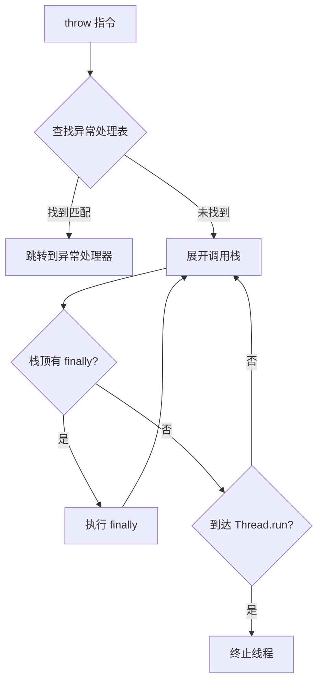

# MiniJVM Java 17 完整支持规划文档

## 版本：v1.0
## 日期：2026-07-10
## 目标：实现符合 Java 17 (JSR 398) 规范的完整 JVM 实现

---

## 一、项目概述

### 1.1 当前状态评估

| 模块 | 当前状态 | 完成度 | 备注 |
|------|---------|--------|------|
| 类文件解析器 | 基础实现 | 30% | 支持常量池基本类型，缺少属性解析 |
| 字节码执行器 | 基础实现 | 20% | 支持约 50 条指令，缺少大量指令 |
| 运行时数据区 | 基础实现 | 25% | 堆、栈帧、方法区基础结构 |
| 对象模型 | 基础实现 | 20% | 支持简单对象创建和字段访问 |
| 方法调用 | 基础实现 | 20% | 支持 invokevirtual, invokespecial, invokestatic |
| 控制流 | 基础实现 | 30% | 支持 if_icmp 系列、goto |
| 垃圾回收 | 未实现 | 0% | - |
| 线程支持 | 未实现 | 0% | - |
| 异常处理 | 未实现 | 0% | - |
| 标准库 | 未实现 | 0% | - |

### 1.2 Java 17 规范要求

Java 17 对应 JVM 规范 **Java SE 17 Edition** (JSR 398)，class 文件版本号为 **61.0**。

核心规范文档：
- [JVM Specification](https://docs.oracle.com/javase/specs/jvms/se17/html/index.html)
- [Java Language Specification](https://docs.oracle.com/javase/specs/jls/se17/html/index.html)

---

## 二、整体架构设计

```mermaid
graph TB
    subgraph "MiniJVM Core"
        direction TB
        
        subgraph "Class Loader Subsystem"
            CL[Class Loader]
            Parser[Class File Parser]
            CP[Constant Pool Resolver]
            Attr[Attribute Parser]
            CL --> Parser --> CP
            Parser --> Attr
        end
        
        subgraph "Runtime Data Areas"
            Heap[Heap (GC Managed)]
            MethodArea[Method Area]
            Stack[Java VM Stack]
            PC[Program Counter]
            NativeStack[Native Method Stack]
            
            Stack --> Frame[Stack Frame]
            Frame --> LV[Local Variables]
            Frame --> OS[Operand Stack]
            Frame --> StackMap[StackMapTable]
        end
        
        subgraph "Execution Engine"
            Interpreter[Interpreter Loop]
            JIT[JIT Compiler - Phase 3]
            NativeLib[Native Interface]
            
            Interpreter --> |Read Opcode| InstrSet[Instruction Set]
            InstrSet --> |Update| Stack
            InstrSet --> |Alloc/Access| Heap
            InstrSet --> |Handle| Exceptions[Exception Handler]
        end
        
        subgraph "GC Subsystem"
            GC[Garbage Collector]
            HeapScanner[Heap Scanner]
            ReferenceProcessor[Reference Processor]
        end
        
        subgraph "Threading Subsystem"
            ThreadManager[Thread Manager]
            Synchronization[Synchronization Primitives]
        end
    end
    
    subgraph "Java Standard Library"
        JavaLang[java.lang Package]
        JavaUtil[java.util Package]
        JavaIO[java.io Package]
        JavaLang --> JavaUtil
        JavaLang --> JavaIO
    end
    
    ClassFile[.class File] --> CL
    GC --> Heap
    ThreadManager --> Stack
    Interpreter --> JavaLang
```

---

## 三、分阶段实施规划

### 阶段一：基础架构重构（第 1-2 周）

#### 3.1.1 项目结构重构

**目标**：建立模块化、可扩展的代码结构

**任务清单**：

| 任务 | 描述 | 优先级 |
|------|------|--------|
| 1.1 | 创建 `src/lib.rs` 作为库入口 | 高 |
| 1.2 | 拆分 `jvm.rs` 为多个模块 | 高 |
| 1.3 | 建立错误处理体系（thiserror） | 高 |
| 1.4 | 添加日志系统（tracing） | 中 |
| 1.5 | 建立测试框架（rstest） | 高 |

**模块划分**：

```
src/
├── lib.rs                 # 库入口
├── main.rs                # CLI 入口
├── error.rs               # 错误定义
├── classfile/
│   ├── mod.rs             # 类文件解析器入口
│   ├── parser.rs          # 二进制解析逻辑
│   ├── constant_pool.rs   # 常量池定义与解析
│   ├── attributes.rs      # 属性解析（Code, StackMapTable, etc.）
│   └── types.rs           # 类/方法/字段数据结构
├── runtime/
│   ├── mod.rs             # 运行时入口
│   ├── heap.rs            # 堆内存管理
│   ├── stack.rs           # JVM 栈与栈帧
│   ├── method_area.rs     # 方法区
│   └── value.rs           # 值类型定义
├── interpreter/
│   ├── mod.rs             # 解释器入口
│   ├── instruction_set.rs # 指令集实现
│   └── dispatch.rs        # 指令分发逻辑
├── gc/
│   ├── mod.rs             # GC 入口
│   ├── mark_sweep.rs      # 标记-清除算法
│   └── reference.rs       # 引用类型处理
├── threading/
│   ├── mod.rs             # 线程入口
│   ├── thread.rs          # 线程实现
│   └── sync.rs            # 同步原语
└── stdlib/
    ├── mod.rs             # 标准库入口
    └── java_lang.rs       # java.lang 包实现
```

#### 3.1.2 数据结构完善

**目标**：完善核心数据结构，支持 Java 17 类型系统

**任务清单**：

| 任务 | 描述 | 优先级 |
|------|------|--------|
| 2.1 | 扩展 Value 枚举，支持所有基本类型 | 高 |
| 2.2 | 完善 HeapObject，支持对象头、字段偏移量 | 高 |
| 2.3 | 实现类型描述符解析器 | 高 |
| 2.4 | 实现方法签名解析器 | 高 |
| 2.5 | 添加 StackMapTable 支持 | 中 |

**扩展的 Value 枚举**：

```rust
pub enum Value {
    // 基本类型
    Int(i32),
    Long(i64),
    Float(f32),
    Double(f64),
    Byte(i8),
    Short(i16),
    Char(u16),
    Boolean(bool),
    // 引用类型
    ObjectRef(usize),
    ArrayRef(usize),
    Null,
}
```

**扩展的 HeapObject**：

```rust
pub struct HeapObject {
    pub class_name: String,
    pub mark_word: MarkWord,           // 对象头标记字
    pub fields: Vec<Value>,            // 字段值（按声明顺序）
    pub string_value: Option<String>,   // 字符串内容
    pub array_length: Option<usize>,    // 数组长度
    pub array_type: Option<ValueType>,  // 数组元素类型
}
```

---

### 阶段二：完整类文件解析器（第 3-4 周）

#### 3.2.1 常量池完整支持

**目标**：支持 Java 17 规范中所有常量池类型

**常量池类型支持矩阵**：

| Tag | 类型 | 当前状态 | 目标状态 | 优先级 |
|-----|------|---------|---------|--------|
| 1 | CONSTANT_Utf8 | ✅ | ✅ | - |
| 3 | CONSTANT_Integer | ✅ | ✅ | - |
| 4 | CONSTANT_Float | ✅ | ✅ | - |
| 5 | CONSTANT_Long | ✅ | ✅ | - |
| 6 | CONSTANT_Double | ✅ | ✅ | - |
| 7 | CONSTANT_Class | ✅ | ✅ | - |
| 8 | CONSTANT_String | ✅ | ✅ | - |
| 9 | CONSTANT_Fieldref | ✅ | ✅ | - |
| 10 | CONSTANT_Methodref | ✅ | ✅ | - |
| 11 | CONSTANT_InterfaceMethodref | ❌ | ✅ | 高 |
| 12 | CONSTANT_NameAndType | ✅ | ✅ | - |
| 15 | CONSTANT_MethodHandle | ⚠️ | ✅ | 中 |
| 16 | CONSTANT_MethodType | ❌ | ✅ | 中 |
| 17 | CONSTANT_Dynamic | ❌ | ✅ | 中 |
| 18 | CONSTANT_InvokeDynamic | ⚠️ | ✅ | 中 |
| 19 | CONSTANT_Module | ❌ | ✅ | 中 |
| 20 | CONSTANT_Package | ❌ | ✅ | 中 |

#### 3.2.2 属性解析器实现

**目标**：支持 Java 17 中所有关键属性

**属性支持矩阵**：

| 属性名 | 用途 | 优先级 |
|--------|------|--------|
| Code | 方法字节码 | 高 |
| StackMapTable | 栈帧类型信息 | 高 |
| LineNumberTable | 行号映射 | 中 |
| LocalVariableTable | 局部变量调试信息 | 中 |
| SourceFile | 源文件名 | 低 |
| InnerClasses | 内部类信息 | 中 |
| EnclosingMethod | 外围方法 | 中 |
| Synthetic | 合成属性标记 | 低 |
| Signature | 泛型签名 | 中 |
| BootstrapMethods | 动态调用引导方法 | 中 |
| NestHost/NestMembers | Nest 宿主/成员 | 中 |

#### 3.2.3 类加载器实现

**目标**：实现符合规范的类加载器

**任务清单**：

| 任务 | 描述 | 优先级 |
|------|------|--------|
| 3.1 | 实现启动类加载器（Bootstrap ClassLoader） | 高 |
| 3.2 | 实现扩展类加载器（Extension ClassLoader） | 中 |
| 3.3 | 实现应用类加载器（Application ClassLoader） | 高 |
| 3.4 | 实现类加载委托机制 | 高 |
| 3.5 | 实现类缓存机制 | 中 |

---

### 阶段三：完整字节码执行引擎（第 5-8 周）

#### 3.3.1 指令集完整实现

**目标**：实现 Java 17 规范中所有字节码指令

**指令分类与完成计划**：

| 类别 | 指令数量 | 当前完成 | 计划完成 | 优先级 |
|------|---------|---------|---------|--------|
| 常量加载 | 20+ | 部分 | 全部 | 高 |
| 局部变量操作 | 20+ | 部分 | 全部 | 高 |
| 栈操作 | 10+ | 部分 | 全部 | 高 |
| 算术运算 | 20+ | 部分 | 全部 | 高 |
| 类型转换 | 10+ | 无 | 全部 | 高 |
| 对象操作 | 15+ | 部分 | 全部 | 高 |
| 方法调用 | 10+ | 部分 | 全部 | 高 |
| 控制流 | 25+ | 部分 | 全部 | 高 |
| 数组操作 | 15+ | 无 | 全部 | 高 |
| 异常处理 | 5+ | 无 | 全部 | 高 |
| 同步 | 4 | 无 | 全部 | 中 |
| 方法返回 | 6 | 部分 | 全部 | 高 |
| 扩展指令 | 10+ | 无 | 全部 | 低 |

**关键指令实现清单**：

| 指令 | 操作码 | 描述 | 优先级 |
|------|--------|------|--------|
| new | 0xBB | 创建对象 | 高 |
| anewarray | 0xBD | 创建引用类型数组 | 高 |
| newarray | 0xBC | 创建基本类型数组 | 高 |
| arraylength | 0xBE | 获取数组长度 | 高 |
| aaload | 0x32 | 数组元素加载 | 高 |
| aastore | 0x53 | 数组元素存储 | 高 |
| checkcast | 0xC0 | 类型转换检查 | 高 |
| instanceof | 0xC1 | 类型检查 | 高 |
| getfield | 0xB4 | 获取实例字段 | 高 |
| putfield | 0xB5 | 设置实例字段 | 高 |
| getstatic | 0xB2 | 获取静态字段 | 高 |
| putstatic | 0xB3 | 设置静态字段 | 高 |
| invokevirtual | 0xB6 | 调用实例方法 | 高 |
| invokespecial | 0xB7 | 调用特殊方法 | 高 |
| invokestatic | 0xB8 | 调用静态方法 | 高 |
| invokeinterface | 0xB9 | 调用接口方法 | 高 |
| invokedynamic | 0xBA | 调用动态方法 | 中 |
| iinc | 0x84 | 局部变量自增 | 高 |
| goto | 0xA7 | 无条件跳转 | 高 |
| goto_w | 0xC8 | 宽跳转 | 中 |
| ifeq | 0x99 | 等于零跳转 | 高 |
| ifne | 0x9A | 不等于零跳转 | 高 |
| iflt | 0x9B | 小于零跳转 | 高 |
| ifge | 0x9C | 大于等于零跳转 | 高 |
| ifgt | 0x9D | 大于零跳转 | 高 |
| ifle | 0x9E | 小于等于零跳转 | 高 |
| if_icmpeq | 0x9F | 整数相等跳转 | 高 |
| if_icmpne | 0xA0 | 整数不等跳转 | 高 |
| if_icmplt | 0xA1 | 整数小于跳转 | 高 |
| if_icmpge | 0xA2 | 整数大于等于跳转 | 高 |
| if_icmpgt | 0xA3 | 整数大于跳转 | 高 |
| if_icmple | 0xA4 | 整数小于等于跳转 | 高 |
| if_acmpeq | 0xA5 | 引用相等跳转 | 高 |
| if_acmpne | 0xA6 | 引用不等跳转 | 高 |
| ireturn | 0xAC | 返回整数 | 高 |
| lreturn | 0xAD | 返回长整数 | 高 |
| freturn | 0xAE | 返回浮点数 | 高 |
| dreturn | 0xAF | 返回双精度 | 高 |
| areturn | 0xB0 | 返回引用 | 高 |
| return | 0xB1 | 返回空 | 高 |
| throw | 0xBF | 抛出异常 | 高 |
| monitorenter | 0xC2 | 进入监视器 | 中 |
| monitorexit | 0xC3 | 退出监视器 | 中 |

#### 3.3.2 类型系统完善

**目标**：实现完整的 JVM 类型系统

**任务清单**：

| 任务 | 描述 | 优先级 |
|------|------|--------|
| 4.1 | 实现类型描述符解析 | 高 |
| 4.2 | 实现方法签名解析 | 高 |
| 4.3 | 实现类型转换（宽化/窄化） | 高 |
| 4.4 | 实现 instanceof 检查 | 高 |
| 4.5 | 实现 checkcast 检查 | 高 |

---

### 阶段四：运行时特性实现（第 9-12 周）

#### 3.4.1 异常处理系统

**目标**：实现完整的异常处理机制

**任务清单**：

| 任务 | 描述 | 优先级 |
|------|------|--------|
| 5.1 | 解析异常处理表（Exception Table） | 高 |
| 5.2 | 实现 throw 指令 | 高 |
| 5.3 | 实现异常栈展开 | 高 |
| 5.4 | 实现 finally 块 | 高 |
| 5.5 | 实现 try-with-resources | 中 |
| 5.6 | 实现异常类型层次 | 高 |

**异常处理流程**：



#### 3.4.2 垃圾回收系统

**目标**：实现标记-清除垃圾回收算法

**任务清单**：

| 任务 | 描述 | 优先级 |
|------|------|--------|
| 6.1 | 实现堆内存分配器 | 高 |
| 6.2 | 实现根集扫描 | 高 |
| 6.3 | 实现标记阶段 | 高 |
| 6.4 | 实现清除阶段 | 高 |
| 6.5 | 实现内存压缩（可选） | 低 |
| 6.6 | 实现引用类型处理 | 中 |

**GC 设计要点**：

- **触发时机**：堆内存使用率达到阈值时
- **暂停策略**：Stop-the-World (STW)
- **引用类型**：支持强引用、软引用、弱引用、虚引用
- **内存分配**：使用 bump pointer 快速分配

#### 3.4.3 线程与同步系统

**目标**：实现基本的多线程支持

**任务清单**：

| 任务 | 描述 | 优先级 |
|------|------|--------|
| 7.1 | 实现 Thread 类 | 高 |
| 7.2 | 实现 Runnable 接口 | 高 |
| 7.3 | 实现 monitorenter/monitorexit | 高 |
| 7.4 | 实现 Object.wait/notify | 中 |
| 7.5 | 实现 Thread.sleep | 中 |

---

### 阶段五：标准库支持（第 13-16 周）

#### 3.5.1 java.lang 包实现

**目标**：实现核心 java.lang 类

**java.lang 类支持矩阵**：

| 类名 | 用途 | 优先级 | 实现要点 |
|------|------|--------|---------|
| Object | 所有类的根 | 高 | getClass, hashCode, equals, toString |
| String | 字符串 | 高 | 不可变字符串实现 |
| StringBuilder | 可变字符串 | 中 | 高效字符串拼接 |
| Class | 类元数据 | 高 | 反射基础 |
| System | 系统操作 | 高 | out, err, in, arraycopy |
| Thread | 线程 | 高 | 多线程支持 |
| Runnable | 可运行接口 | 高 | run() 方法 |
| Exception | 异常基类 | 高 | 异常层次结构 |
| RuntimeException | 运行时异常 | 高 | 非检查异常 |
| Error | 错误 | 中 | 严重错误 |
| Integer | 整数包装类 | 中 | 自动装箱/拆箱 |
| Long | 长整数包装类 | 中 | 自动装箱/拆箱 |
| Float | 浮点数包装类 | 中 | 自动装箱/拆箱 |
| Double | 双精度包装类 | 中 | 自动装箱/拆箱 |
| Boolean | 布尔包装类 | 中 | 自动装箱/拆箱 |
| Character | 字符包装类 | 中 | 自动装箱/拆箱 |
| Byte | 字节包装类 | 低 | 自动装箱/拆箱 |
| Short | 短整数包装类 | 低 | 自动装箱/拆箱 |
| Math | 数学运算 | 中 | 基本数学函数 |
| StrictMath | 严格数学 | 低 | IEEE 754 规范 |
| ThreadLocal | 线程本地变量 | 中 | 线程隔离存储 |

#### 3.5.2 java.io 包实现

**目标**：实现基本的 IO 功能

**任务清单**：

| 任务 | 描述 | 优先级 |
|------|------|--------|
| 8.1 | 实现 PrintStream | 高 | System.out 底层实现 |
| 8.2 | 实现 InputStream | 中 | 字节输入流 |
| 8.3 | 实现 OutputStream | 中 | 字节输出流 |
| 8.4 | 实现 Reader/Writer | 低 | 字符流 |

---

### 阶段六：Java 17 新特性支持（第 17-20 周）

#### 3.6.1 Java 17 新增语言特性

**目标**：支持 Java 17 引入的语言特性

| 特性 | JEP | 描述 | 优先级 | 实现复杂度 |
|------|-----|------|--------|-----------|
| Sealed Classes | JEP 409 | 密封类和接口 | 中 | 中等 |
| Records | JEP 395 | 记录类 | 高 | 低 |
| Pattern Matching for instanceof | JEP 406 | instanceof 模式匹配 | 中 | 低 |
| Switch Expressions | JEP 361 | switch 表达式 | 中 | 低 |
| Text Blocks | JEP 378 | 文本块 | 低 | 低 |
| Helpful NullPointerExceptions | JEP 358 | 有用的空指针异常 | 中 | 低 |

**Sealed Classes 实现要点**：

- 解析 `permits` 关键字
- 验证子类只能是指定的类
- 在常量池中添加密封类信息

**Records 实现要点**：

- 自动生成构造函数
- 自动生成 getter 方法
- 自动生成 equals/hashCode/toString

---

### 阶段七：性能优化与测试（第 21-24 周）

#### 3.7.1 性能优化

**目标**：优化执行性能

| 优化项 | 描述 | 优先级 |
|--------|------|--------|
| 指令分发优化 | 使用跳转表替代 match | 高 |
| 栈帧分配优化 | 使用 Arena 分配器 | 中 |
| 字符串池优化 | 字符串常量去重 | 中 |
| LTO 优化 | 启用链接时优化 | 高 |

#### 3.7.2 测试体系

**目标**：建立完整的测试体系

| 测试类型 | 描述 | 优先级 |
|----------|------|--------|
| 单元测试 | 单个函数/模块测试 | 高 |
| 集成测试 | 多模块协作测试 | 高 |
| 字节码测试 | 单个指令测试 | 高 |
| 功能测试 | 完整 Java 程序测试 | 高 |
| 回归测试 | 确保修改不破坏功能 | 高 |

**测试用例覆盖**：

- ✅ StringTest - 字符串操作
- ✅ IntTest - 整数操作
- ✅ ObjectTest - 对象操作
- ✅ LoopTest - 循环操作
- ⬜ ArrayTest - 数组操作
- ⬜ ExceptionTest - 异常处理
- ⬜ ThreadTest - 多线程
- ⬜ GenericTest - 泛型
- ⬜ LambdaTest - Lambda 表达式
- ⬜ RecordTest - 记录类
- ⬜ SealedTest - 密封类

---

## 四、技术栈与依赖

| 模块 | 推荐 Crate | 版本 | 理由 |
|------|-----------|------|------|
| 命令行参数 | clap | 4.x | 强大的 CLI 解析 |
| 日志 | tracing | 0.1.x | 结构化日志 |
| 错误处理 | thiserror | 1.x | 优雅的错误定义 |
| 测试 | rstest | 0.18.x | 参数化测试 |
| 内存分配 | bumpalo | 3.x | Arena 分配器 |
| 并发 | crossbeam | 0.8.x | 并发原语 |
| 时间 | chrono | 0.4.x | 时间处理 |

---

## 五、里程碑与验收标准

### 5.1 里程碑定义

| 里程碑 | 阶段 | 完成时间 | 验收标准 |
|--------|------|---------|---------|
| M1 | 阶段一完成 | 第 2 周 | 项目结构重构完成，编译通过 |
| M2 | 阶段二完成 | 第 4 周 | 能解析任意 Java 17 class 文件 |
| M3 | 阶段三完成 | 第 8 周 | 能执行包含所有指令的 Java 程序 |
| M4 | 阶段四完成 | 第 12 周 | 支持异常处理、GC、多线程 |
| M5 | 阶段五完成 | 第 16 周 | 支持核心标准库 |
| M6 | 阶段六完成 | 第 20 周 | 支持 Java 17 新特性 |
| M7 | 阶段七完成 | 第 24 周 | 性能优化完成，测试覆盖率 > 80% |

### 5.2 验收测试用例

**核心功能测试**：

```java
// TestCase1: HelloWorld
public class HelloWorld {
    public static void main(String[] args) {
        System.out.println("Hello, Java 17!");
    }
}

// TestCase2: 数组操作
public class ArrayTest {
    public static void main(String[] args) {
        int[] arr = new int[5];
        for (int i = 0; i < arr.length; i++) {
            arr[i] = i * 2;
        }
        int sum = 0;
        for (int val : arr) {
            sum += val;
        }
        System.out.println(sum); // 预期: 20
    }
}

// TestCase3: 异常处理
public class ExceptionTest {
    public static void main(String[] args) {
        try {
            int result = divide(10, 0);
            System.out.println(result);
        } catch (ArithmeticException e) {
            System.out.println("Division by zero");
        } finally {
            System.out.println("Finally block");
        }
    }
    
    static int divide(int a, int b) {
        return a / b;
    }
}

// TestCase4: 记录类 (Java 17)
public record Point(int x, int y) {
    public int distance(Point other) {
        int dx = x - other.x;
        int dy = y - other.y;
        return (int) Math.sqrt(dx * dx + dy * dy);
    }
}

public class RecordTest {
    public static void main(String[] args) {
        Point p1 = new Point(3, 4);
        Point p2 = new Point(0, 0);
        System.out.println(p1.x()); // 3
        System.out.println(p1.distance(p2)); // 5
    }
}
```

---

## 六、风险评估与应对策略

| 风险 | 概率 | 影响 | 应对策略 |
|------|------|------|---------|
| 指令集实现遗漏 | 高 | 中 | 建立完整的指令清单，逐个实现 |
| 内存安全问题 | 中 | 高 | 利用 Rust 所有权模型，严格审查 unsafe 代码 |
| GC 实现复杂 | 中 | 高 | 分阶段实现，先实现简单引用计数 |
| 标准库实现工作量大 | 高 | 中 | 优先实现核心类，其他类返回 NotImplementedError |
| 性能瓶颈 | 中 | 中 | 后期进行性能分析和优化 |
| 线程安全问题 | 中 | 高 | 使用 Arc/Mutex，避免共享可变状态 |

---

## 七、结论

完整支持 Java 17 是一个庞大的工程，预计需要 **24 周**（约 6 个月）的开发时间。建议按照上述分阶段规划逐步实施，每个阶段完成后进行严格的测试验证。

**推荐的下一步行动**：

1. **立即开始阶段一**：项目结构重构和数据结构完善
2. **建立测试驱动开发流程**：每个功能模块都要有对应的测试用例
3. **定期代码审查**：确保代码质量和规范遵守
4. **性能监控**：从早期阶段就关注性能指标

---

**文档版本历史**：

| 版本 | 日期 | 作者 | 修改内容 |
|------|------|------|---------|
| v1.0 | 2026-07-10 | AI Assistant | 初始版本 |
